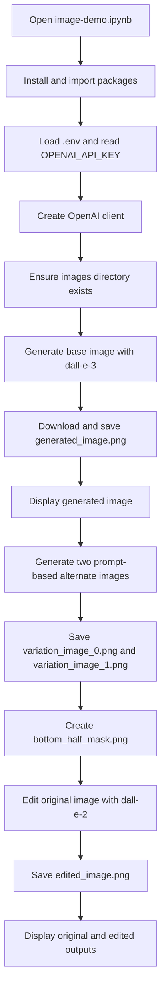
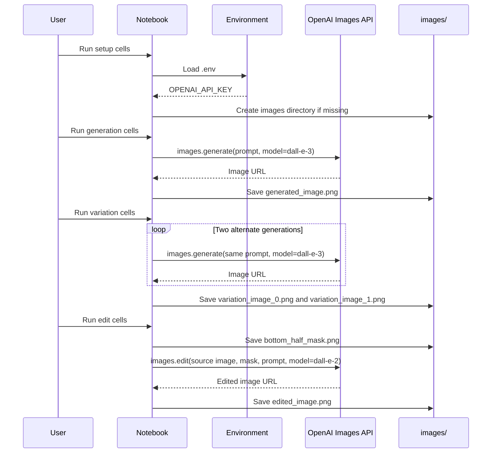
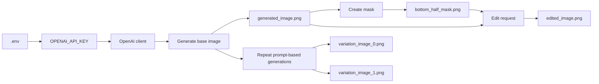
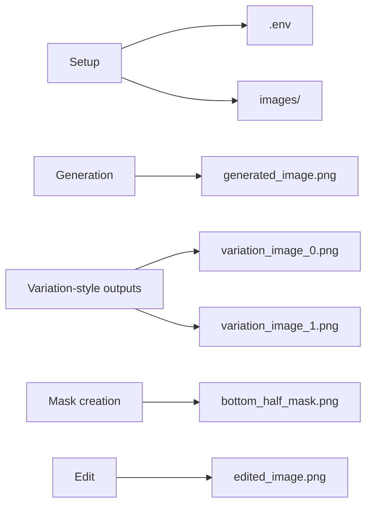

# image-demo Notebook Diagrams

This document complements the main README with Mermaid charts for the image demo notebook in [image-demo.ipynb](/Users/ivanp/Downloads/demo/image-demo.ipynb).

## Notebook Flow

## Runtime Interaction

## Artifact Map

## Section-to-File Relationship

## Notes

- The notebook's "Variations" section is implemented as repeated prompt-based generations, not as a call to the removed legacy variation endpoint.
- The current workspace already contains [generated_image.png](/Users/ivanp/Downloads/demo/images/generated_image.png).
- Additional files appear only after their corresponding notebook sections are run.